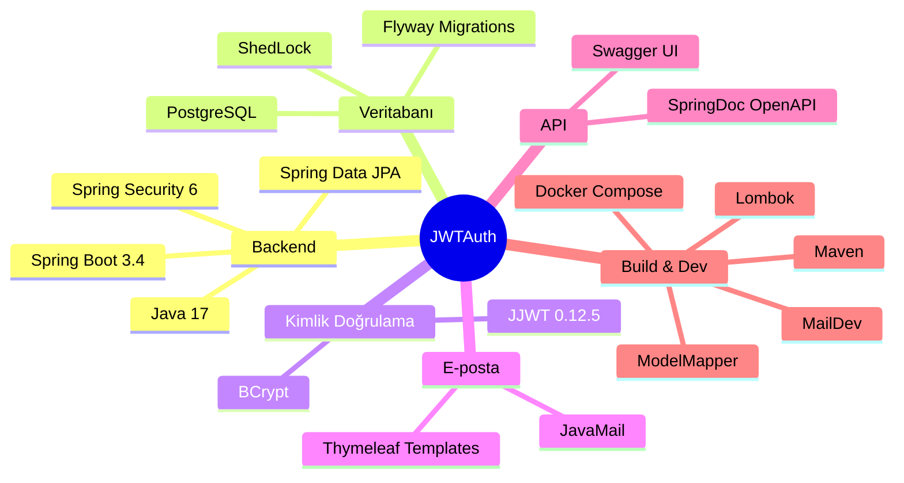
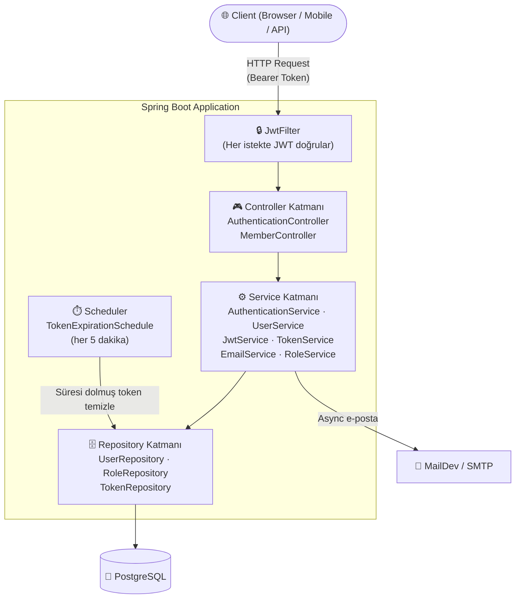
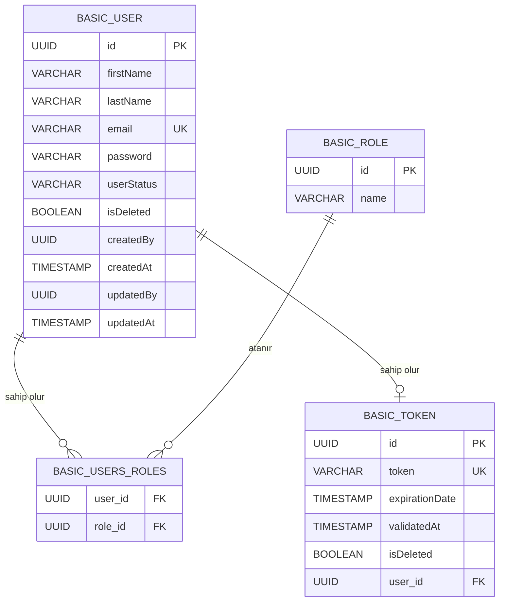
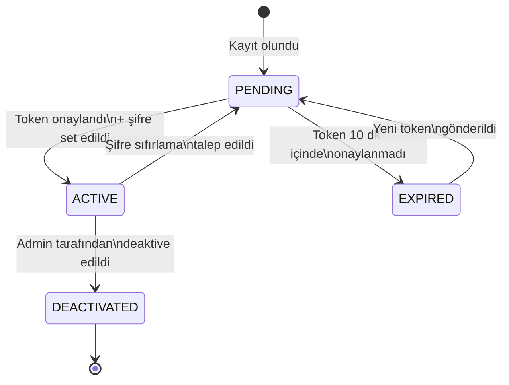
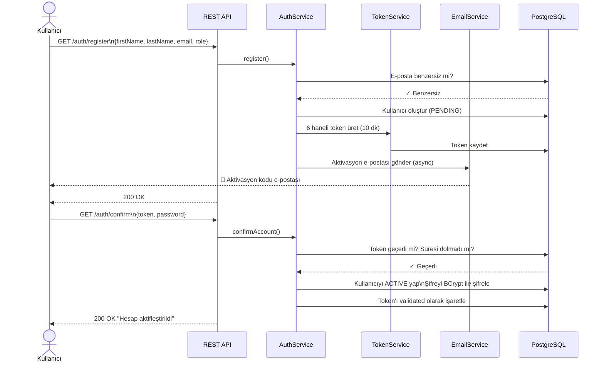
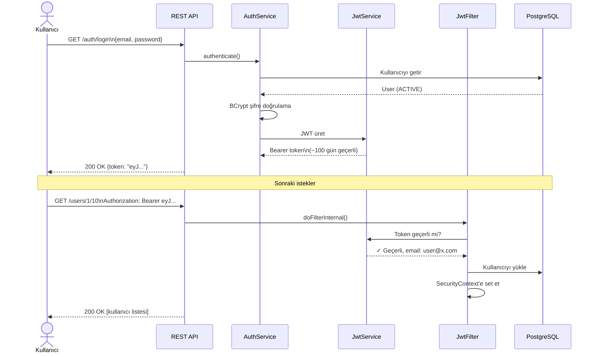
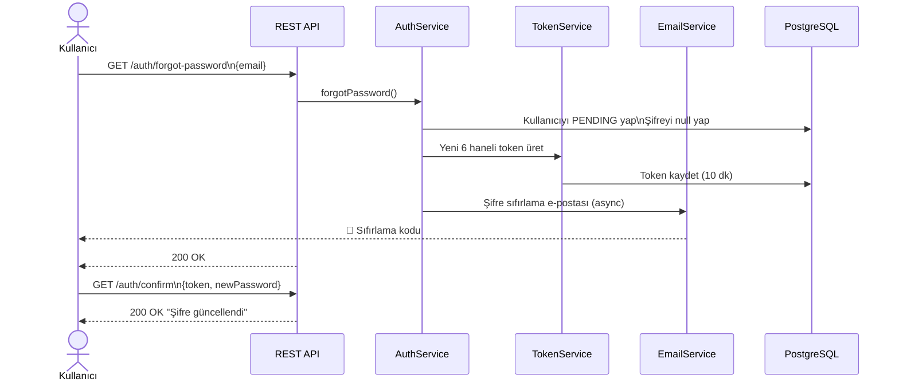
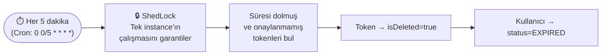
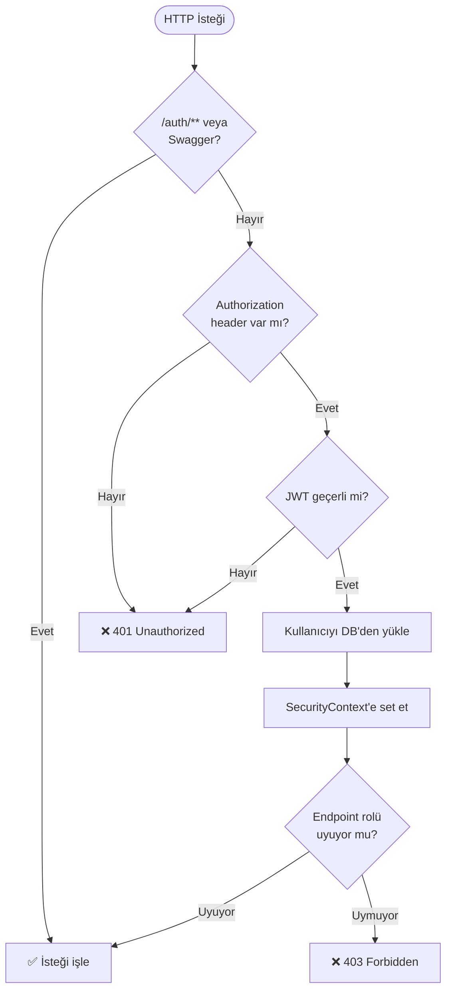
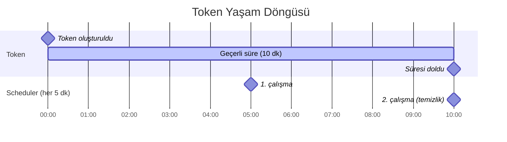

# JWTAuth — Proje Dokümantasyonu

> Spring Boot 3.4 tabanlı, JWT kimlik doğrulama ve kullanıcı yönetim servisi.

---

## İçindekiler

- [Teknoloji Yığını](#teknoloji-yığını)
- [Mimari](#mimari)
- [Veri Modeli (Entity Diyagramı)](#veri-modeli)
- [Kimlik Doğrulama Akışı](#kimlik-doğrulama-akışı)
- [API Endpoint'leri](#api-endpointleri)
- [Güvenlik Katmanı](#güvenlik-katmanı)
- [Zamanlayıcı](#zamanlayıcı)

---

## Teknoloji Yığını



| Katman | Teknoloji | Versiyon |
|---|---|---|
| Framework | Spring Boot | 3.4.0 |
| Dil | Java | 17 |
| Güvenlik | Spring Security + JJWT | 6.x / 0.12.5 |
| ORM | Spring Data JPA / Hibernate | — |
| Veritabanı | PostgreSQL | — |
| Migration | Flyway | — |
| E-posta | JavaMail + Thymeleaf | — |
| API Dokümantasyon | SpringDoc OpenAPI | 2.8.4 |
| Zamanlama | Spring Scheduler + ShedLock | 5.10.0 |
| Build | Maven | — |
| Geliştirme Servisleri | Docker Compose (PostgreSQL + MailDev) | — |

---

## Mimari

### Katmanlı Mimari



### Paket Yapısı

```
com.auth.JWTAuth/
├── config/
│   ├── security/
│   │   ├── SecurityConfig.java       ← HTTP güvenlik kuralları, CORS, CSRF
│   │   └── JwtFilter.java            ← Her istekte JWT doğrulama filtresi
│   ├── ApplicationConfig.java        ← AuthProvider, PasswordEncoder (BCrypt)
│   ├── OpenApiConfig.java            ← Swagger konfigürasyonu
│   ├── MessageSourceConfig.java      ← i18n mesaj kaynağı
│   └── ScheduleConfig.java           ← ShedLock konfigürasyonu
├── controller/
│   ├── BaseController.java           ← Ortak auth context
│   ├── AuthenticationController.java ← Kayıt, giriş, onay, şifre sıfırlama
│   └── MemberController.java         ← Kullanıcı yönetimi
├── domain/
│   ├── entity/
│   │   ├── User.java                 ← UserDetails implement eder
│   │   ├── Role.java
│   │   └── Token.java
│   └── dto/
│       ├── BasicUserDTO.java
│       ├── RoleDTO.java
│       └── request/                  ← İstek DTO'ları
├── service/
│   ├── AuthenticationService.java
│   ├── UserService.java
│   ├── JwtService.java
│   ├── TokenService.java
│   ├── EmailService.java
│   └── RoleService.java
├── repository/
│   ├── UserRepository.java
│   ├── RoleRepository.java
│   ├── TokenRepository.java
│   └── specification/
│       └── UserSpecification.java    ← Dinamik sorgular
├── exception/
│   ├── GlobalExceptionHandler.java
│   └── types/                        ← BadRequest, NotFound, Permission, Conflict
├── schedule/
│   └── TokenExpirationSchedule.java
└── util/
    ├── ContextUtil.java              ← SecurityContext'ten mevcut kullanıcı
    ├── ModelMapperUtils.java
    └── validation/                   ← @ValidEmail, @ValidFirstName, @ValidLastName
```

---

## Veri Modeli

### Entity İlişki Diyagramı



### Kullanıcı Durumları



---

## Kimlik Doğrulama Akışı

### Kayıt ve Aktivasyon



### Giriş ve JWT Kullanımı



### Şifre Sıfırlama



### Token Temizleme (Scheduler)



---

## API Endpoint'leri

**Base URL:** `http://localhost:8080/api/v1/`

### Kimlik Doğrulama (`/auth`) — Herkese Açık

| Yöntem | Endpoint | Açıklama | İstek Gövdesi |
|---|---|---|---|
| GET | `/auth/register` | Yeni kullanıcı kaydı | `{firstName, lastName, email, role}` |
| GET | `/auth/confirm` | Hesap aktivasyonu | `{token, password}` |
| GET | `/auth/login` | Giriş yap → JWT al | `{email, password}` |
| GET | `/auth/forgot-password` | Şifre sıfırlama talebi | `{email}` |

### Kullanıcı Yönetimi (`/users`) — Kimlik Doğrulama Gerektirir

| Yöntem | Endpoint | Açıklama | Yetki |
|---|---|---|---|
| GET | `/users/{page}/{size}` | Sayfalı kullanıcı listesi (opsiyonel: firstName, lastName, email filtresi) | Herhangi bir auth |
| GET | `/users/{uuid}` | UUID ile kullanıcı getir | Herhangi bir auth |
| PUT | `/users` | Kendi profilini düzenle | Herhangi bir auth (yalnızca kendi kaydı) |
| PUT | `/users/change-role` | Kullanıcı rolü değiştir | **Yalnızca SUPER** |

### Hata Yanıt Formatı

```json
{
  "status": 400,
  "errors": [
    {
      "source": "email",
      "detail": "Geçersiz e-posta formatı"
    }
  ]
}
```

---

## Güvenlik Katmanı



### JWT Token İçeriği

| Alan | Değer |
|---|---|
| Subject | Kullanıcı e-postası |
| `fullName` claim | Ad Soyad |
| `authorities` claim | Kullanıcı rolleri |
| İmzalama | HMAC SHA-256 |
| Geçerlilik | 8.640.000 ms (~100 gün) |

### Rol Yetkilendirmesi

| Rol | Yetkiler |
|---|---|
| **SUPER** | Tüm endpoint'ler + rol atama |
| **ADMIN** | Kullanıcı listeleme, görüntüleme, profil düzenleme |
| **USER** | Kullanıcı listeleme, görüntüleme, kendi profilini düzenleme |

---

## Zamanlayıcı



- Cron ifadesi: `0 0/5 * * * *` (her 5 dakikada bir)
- ShedLock ile yalnızca tek instance çalışır
- Süresi dolmuş tokenlar `isDeleted=true` yapılır
- İlgili kullanıcı `EXPIRED` statüsüne alınır

---

## Geliştirme Ortamı Kurulumu

```bash
# 1. Servisleri başlat (PostgreSQL + MailDev)
docker-compose up -d

# 2. Uygulamayı çalıştır
mvn spring-boot:run

# 3. Swagger UI
http://localhost:8080/api/v1/swagger-ui.html

# 4. MailDev (e-posta önizleme)
http://localhost:1080

# 5. Testleri çalıştır
mvn test
```

---

## Veritabanı Migrasyonları (Flyway)

| Versiyon | Dosya | İçerik |
|---|---|---|
| V1.1 | `V1_1__initial_create.sql` | Tabloları oluşturur (basic_role, basic_user, basic_token, basic_users_roles) |
| V1.2 | `V1_2__add_foreign_keys.sql` | Foreign key kısıtlamaları |
| V1.3 | `V1_3__initial_insert.sql` | Varsayılan rolleri ekler (SUPER, ADMIN, USER) |
| V1.4 | `V1_4__create_super_user.java` | Super kullanıcıyı programatik olarak oluşturur |
